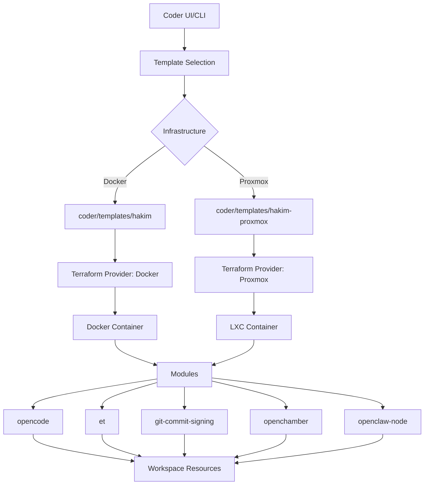
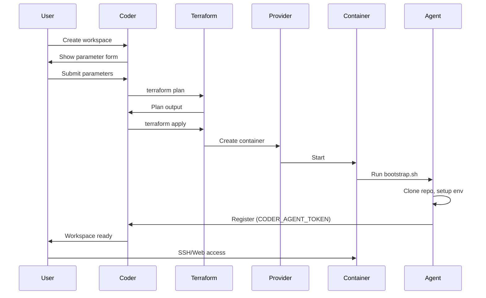

Hakim provides two Terraform templates for provisioning Coder workspaces on different infrastructure targets: Docker containers and Proxmox LXC containers.

## Template architecture



## Template comparison

| Feature | Docker Template | Proxmox Template |
| :--- | :--- | :--- |
| **File** | `coder/templates/hakim/main.tf` | `coder/templates/hakim-proxmox/main.tf` |
| **Provider** | `kreuzwerker/docker` | `Telmate/proxmox` |
| **Target** | Docker containers | LXC containers |
| **Networking** | Bridge/host networks | Proxmox VLANs |
| **Storage** | Docker volumes | Bind mounts or ZFS datasets |
| **CPU/Memory** | Optional limits | Hard quotas |
| **Nesting** | Requires privileged mode | Native LXC nesting |
| **Best for** | Local dev, cloud VMs | Bare-metal, private cloud |

## Template structure

Both templates follow a common structure:

```hcl
terraform {
  required_providers {
    coder = {
      source  = "coder/coder"
      version = ">= 2.13"
    }
    docker = {  # or proxmox
      source = "kreuzwerker/docker"
    }
  }
}

# Workspace metadata
data "coder_workspace" "me" {}
data "coder_workspace_owner" "me" {}
data "coder_provisioner" "me" {}

# Parameters (user inputs)
data "coder_parameter" "image_variant" { ... }
data "coder_parameter" "git_url" { ... }
data "coder_parameter" "opencode_auth" { ... }
# ... 40+ parameters

# Modules
module "opencode" {
  source  = "../../modules/opencode"
  agent_id = coder_agent.main.id
  workdir = "/home/coder"
  # ...
}

module "et" {
  source   = "../../modules/et"
  agent_id = coder_agent.main.id
  count    = data.coder_parameter.enable_et.value ? 1 : 0
}

# Container resource
resource "docker_container" "workspace" {  # or proxmox_lxc
  image = local.image_name
  name  = "coder-${data.coder_workspace.me.owner}-${data.coder_workspace.me.name}"
  # ...
}

# Coder agent
resource "coder_agent" "main" {
  arch = data.coder_provisioner.me.arch
  os   = "linux"
  startup_script = templatefile("${path.module}/bootstrap.sh", { ... })
  # ...
}

# Workspace apps
resource "coder_app" "code-server" { ... }
resource "coder_app" "preview" { ... }
```

## Key components

### Parameters

Templates expose 40+ configurable parameters:

<AccordionGroup>
  <Accordion title="Environment selection">
    - `image_variant` - Choose from base, php, dotnet, rust, js, elixir, android
    - `image_url` - Custom image URL (when variant is "custom")
  </Accordion>
  
  <Accordion title="Git configuration">
    - `git_url` - Repository to auto-clone on workspace start
    - `git_branch` - Branch to checkout
    - `git_commit` - Specific commit SHA
    - `git_author_name` / `git_author_email` - Git identity
  </Accordion>
  
  <Accordion title="OpenCode (AI assistant)">
    - `opencode_auth` - Authentication JSON (API keys)
    - `opencode_config` - Configuration JSON (model preferences)
    - `opencode_enabled` - Enable/disable OpenCode
  </Accordion>
  
  <Accordion title="Development tools">
    - `enable_et` - Resilient SSH via EternalTerminal
    - `enable_git_commit_signing` - Automatic GPG signing
    - `preview_port` - Port for app previews
    - `setup_script` - Custom startup script
  </Accordion>
  
  <Accordion title="Resource limits">
    - `cpu_limit` - CPU cores (Docker) or units (Proxmox)
    - `memory_limit` - Memory in MB
  </Accordion>
</AccordionGroup>

See [Template parameters reference](/reference/configuration/template-parameters) for complete documentation.

### Modules

Templates compose reusable Terraform modules:

<CardGroup cols={2}>
  <Card title="opencode" icon="robot" href="/reference/modules/opencode">
    OpenCode AI assistant with automatic installation and supervision
  </Card>
  <Card title="et" icon="shield-halved" href="/reference/modules/et">
    EternalTerminal for resilient SSH connections
  </Card>
  <Card title="git-commit-signing" icon="signature" href="/reference/modules/git-commit-signing">
    Automatic Git commit signing via Coder's signing service
  </Card>
</CardGroup>

### Bootstrap script

The `bootstrap.sh` script runs when the workspace starts:

```bash
#!/usr/bin/env bash
set -euo pipefail

# Phase 1: Environment setup
export GIT_REPO_URL="${GIT_REPO_URL}"
export GIT_BRANCH="${GIT_BRANCH}"
# ... all template variables

# Phase 2: Git repository clone
if [ -n "$GIT_REPO_URL" ]; then
  git clone "$GIT_REPO_URL" /home/coder/repo
  cd /home/coder/repo
  git checkout "$GIT_BRANCH"
fi

# Phase 3: User environment variables
if [ -n "$USER_ENV_VARS" ]; then
  echo "$USER_ENV_VARS" > /home/coder/.env
fi

# Phase 4: Custom setup script
if [ -n "$SETUP_SCRIPT" ]; then
  eval "$SETUP_SCRIPT"
fi

# Phase 5: Start services (OpenCode, ET, etc.)
# Managed by Coder agent and modules
```

The bootstrap script is templated with Terraform variables, allowing:
- Dynamic configuration based on parameters
- Conditional logic (e.g., only clone git repo if URL provided)
- Environment variable injection

### Workspace apps

Templates define web applications accessible from the Coder dashboard:

```hcl
resource "coder_app" "code-server" {
  agent_id     = coder_agent.main.id
  slug         = "code-server"
  display_name = "VS Code"
  url          = "http://localhost:13337/?folder=/home/coder"
  icon         = "/icon/code.svg"
  subdomain    = true
  share        = "owner"
}

resource "coder_app" "preview" {
  agent_id     = coder_agent.main.id
  slug         = "preview"
  display_name = "App Preview"
  url          = "http://localhost:${data.coder_parameter.preview_port.value}"
  icon         = "/icon/globe.svg"
  subdomain    = true
  share        = "owner"
}
```

Apps support:
- Web IDE (code-server)
- App previews (frontend dev servers)
- Database UIs
- Custom tools

## Docker template specifics

### Container configuration

```hcl
resource "docker_container" "workspace" {
  image = local.image_name
  name  = "coder-${data.coder_workspace.me.owner}-${data.coder_workspace.me.name}"
  
  # Coder agent environment
  env = [
    "CODER_AGENT_TOKEN=${coder_agent.main.token}",
    "CODER_AGENT_URL=${data.coder_workspace.me.access_url}",
    # ... more env vars
  ]
  
  # Docker socket access
  volumes {
    container_path = "/var/run/docker.sock"
    host_path      = "/var/run/docker.sock"
  }
  
  # Persistent storage
  volumes {
    volume_name    = docker_volume.home.name
    container_path = "/home/coder"
  }
  
  # Resource limits
  memory = data.coder_parameter.memory_limit.value
  cpus   = data.coder_parameter.cpu_limit.value
  
  # Networking
  networks_advanced {
    name = docker_network.workspace.name
  }
}
```

### Volume management

```hcl
resource "docker_volume" "home" {
  name = "coder-${data.coder_workspace.me.owner}-${data.coder_workspace.me.name}-home"
}
```

Volumes persist across workspace rebuilds, preserving:
- Git repositories
- IDE settings
- SSH keys
- Browser profiles

## Proxmox template specifics

### LXC configuration

```hcl
resource "proxmox_lxc" "workspace" {
  target_node  = data.coder_parameter.proxmox_node.value
  hostname     = "${data.coder_workspace.me.owner}-${data.coder_workspace.me.name}"
  ostemplate   = "local:vztmpl/hakim-${data.coder_parameter.image_variant.value}.tar.gz"
  
  # Resources
  cores    = data.coder_parameter.cpu_limit.value
  memory   = data.coder_parameter.memory_limit.value
  
  # Nesting for Docker-in-Docker
  features {
    nesting = true
  }
  
  # Persistent home directory
  mountpoint {
    key     = "0"
    slot    = 0
    storage = data.coder_parameter.storage_pool.value
    volume  = "/home/coder"
    size    = "50G"
  }
  
  # Network
  network {
    name   = "eth0"
    bridge = "vmbr0"
    tag    = data.coder_parameter.vlan_id.value
    ip     = "dhcp"
  }
}
```

### Persistent storage

Proxmox supports multiple storage strategies:

<Tabs>
  <Tab title="Bind mounts">
    ```hcl
    mountpoint {
      key     = "0"
      slot    = 0
      storage = "local"
      volume  = "/mnt/pve/workspaces/${data.coder_workspace.me.owner}/${data.coder_workspace.me.name}"
      size    = "50G"
      mp      = "/home/coder"
    }
    ```
    
    Uses host filesystem directly.
  </Tab>
  
  <Tab title="ZFS datasets">
    ```hcl
    mountpoint {
      key     = "0"
      slot    = 0
      storage = "zfs-pool"
      volume  = "${data.coder_workspace.me.owner}-${data.coder_workspace.me.name}-home"
      size    = "50G"
      mp      = "/home/coder"
    }
    ```
    
    Creates ZFS dataset with snapshots and compression.
  </Tab>
</Tabs>

## Workspace presets

Presets provide quick-start configurations:

```hcl
resource "coder_workspace_preset" "laravel" {
  name         = "Laravel Project"
  description  = "PHP 8.4 workspace with Laravel and MySQL"
  icon         = "/icon/laravel.svg"
  
  parameter_values = [
    {
      name  = "image_variant"
      value = "php"
    },
    {
      name  = "preview_port"
      value = "8000"
    },
    {
      name  = "setup_script"
      value = <<-EOT
        composer create-project laravel/laravel example-app
        cd example-app
        php artisan serve --host=0.0.0.0 --port=8000
      EOT
    }
  ]
}
```

Users can select presets when creating workspaces, automatically configuring all parameters.

## Provisioning workflow



## State management

Terraform state is managed by Coder:
- Stored in Coder's database
- Automatically locked during operations
- No manual state file management required
- Rollback support on failures

## Template updates

When templates are updated:

<Steps>
  <Step title="Edit template files">
    Modify `main.tf`, add parameters, update modules
  </Step>
  
  <Step title="Push to version control">
    ```bash
    git commit -am "feat: add custom feature"
    git push
    ```
  </Step>
  
  <Step title="Update template in Coder">
    ```bash
    coder templates push hakim
    ```
  </Step>
  
  <Step title="Notify users">
    Existing workspaces show an "Update available" badge. Users can rebuild to get changes.
  </Step>
</Steps>

## Next steps

<CardGroup cols={2}>
  <Card title="Template parameters" icon="sliders" href="/reference/configuration/template-parameters">
    Complete reference for all template parameters
  </Card>
  <Card title="Terraform modules" icon="cube" href="/reference/modules/opencode">
    Documentation for reusable modules
  </Card>
  <Card title="Customizing templates" icon="wrench" href="/guides/customizing-templates">
    Guide to modifying templates for your needs
  </Card>
  <Card title="Workspace management" icon="server" href="/operations/workspace-management">
    Learn how to manage workspace lifecycle
  </Card>
</CardGroup>