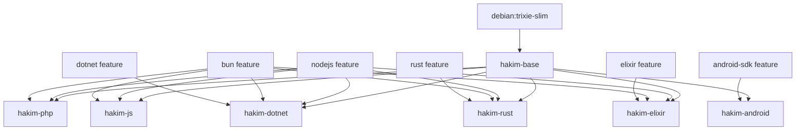

Hakim provides seven prebuilt DevContainer images for different language stacks, all built on a common base image with composable features.

## Image hierarchy



## Base image: hakim-base

The base image (`ghcr.io/shekohex/hakim-base`) provides core infrastructure for all variants:

### System foundation

- **OS**: Debian Trixie (testing) with snapshot repositories for reproducibility
- **User**: `coder` (UID 1000) with passwordless sudo and Docker group membership
- **Locale**: UTF-8 (en_US.UTF-8)

### Core tooling

<AccordionGroup>
  <Accordion title="Docker tooling">
    - Docker CLI 28.3.3
    - Docker Compose 2.29.7
    - Docker Buildx 0.29.1
    - Direct Docker socket access (via group membership)
  </Accordion>
  
  <Accordion title="Coder integration">
    - Coder CLI 2.29.7
    - code-server 4.109.2 (VS Code in browser)
    - EternalTerminal (et) for resilient SSH
    - OpenSSH server with secure defaults
  </Accordion>
  
  <Accordion title="CLI utilities via Mise">
    - Starship prompt (cross-shell)
    - Zoxide (smart cd)
    - fd (fast find)
    - ripgrep (fast grep)
    - bat (better cat)
    - eza (better ls)
    - delta (better diff)
    - jq/yq (JSON/YAML)
    - LazyVim/LazyGit
  </Accordion>
  
  <Accordion title="Browser automation">
    - Chrome for Testing 146.0.7680.31
    - ChromeDriver 146.0.7680.31
    - Headless mode support
  </Accordion>
</AccordionGroup>

### Build architecture

The base Dockerfile uses a multi-stage build for optimal caching:

```dockerfile
# Stage 1: Base system packages (rarely changes)
FROM debian:trixie-slim AS base-system
# Install: curl, git, build-essential, sudo, etc.

# Stage 2a-2f: Download binaries (version-isolated)
FROM base-system AS coder-downloader
FROM base-system AS code-server-downloader
FROM base-system AS docker-compose-downloader
FROM base-system AS docker-buildx-downloader
FROM base-system AS chrome-for-testing-downloader

# Stage 3: Install mise + tools (config-isolated)
FROM base-system AS mise-installer
# Copy mise.toml and install all CLI tools

# Final Stage: Assemble everything
FROM base-system AS final
COPY --from=coder-downloader /downloads/coder /usr/local/bin/
COPY --from=code-server-downloader /downloads/code-server /usr/local/lib/
COPY --from=mise-installer /usr/local/bin/mise /usr/local/bin/
COPY --from=mise-installer /usr/local/share/mise /usr/local/share/mise
# ... more tooling
```

This structure allows:
- Parallel stage execution
- Layer cache reuse when only versions change
- Minimal rebuilds on configuration updates

## Image variants

Variants are built from the base image using DevContainer features:

<CardGroup cols={2}>
  <Card title="hakim-php" icon="php" href="/reference/images/php">
    PHP 8.4 + Laravel + Node.js + Bun
  </Card>
  <Card title="hakim-dotnet" icon="microsoft" href="/reference/images/dotnet">
    .NET 9.0 + 10.0 + Node.js + Bun
  </Card>
  <Card title="hakim-rust" icon="rust" href="/reference/images/rust">
    Rust stable + Node.js + Bun
  </Card>
  <Card title="hakim-js" icon="node-js" href="/reference/images/js">
    Node.js LTS + Bun + pnpm + yarn
  </Card>
  <Card title="hakim-elixir" icon="fire" href="/reference/images/elixir">
    Elixir + Phoenix + PostgreSQL tools
  </Card>
  <Card title="hakim-android" icon="android" href="/reference/images/android">
    Android SDK + NDK + Java 17
  </Card>
</CardGroup>

## DevContainer features

Features are modular installation units defined by `devcontainer-feature.json`:

```json
{
  "name": "Node.js (via Mise)",
  "id": "nodejs",
  "version": "1.0.1",
  "description": "Installs Node.js using Mise.",
  "options": {
    "version": {
      "type": "string",
      "proposals": ["latest", "lts", "24", "22", "20", "18"],
      "default": "24.13.0",
      "description": "Select the version of Node.js to install."
    }
  },
  "installsAfter": [
    "ghcr.io/devcontainers/features/common-utils",
    "../../mise"
  ]
}
```

Features can:
- Depend on other features (via `installsAfter`)
- Wrap upstream features (via `features` property)
- Accept options for version/configuration
- Use Mise for version management

See [DevContainer features reference](/reference/features/overview) for complete feature documentation.

## Build process

Images are built using the `scripts/build.sh` automation:

<Steps>
  <Step title="Build base image">
    ```bash
    docker build -f devcontainers/base/Dockerfile \
      -t ghcr.io/shekohex/hakim-base:latest .
    ```
    
    Multi-stage build with BuildKit caching for faster rebuilds.
  </Step>
  
  <Step title="Build variant images">
    ```bash
    devcontainer build \
      --workspace-folder devcontainers/.devcontainer/images/php \
      --image-name ghcr.io/shekohex/hakim-php:latest
    ```
    
    DevContainer CLI applies features defined in `devcontainer.json`.
  </Step>
  
  <Step title="Push to registry (optional)">
    ```bash
    docker push ghcr.io/shekohex/hakim-base:latest
    docker push ghcr.io/shekohex/hakim-php:latest
    # ... all variants
    ```
  </Step>
</Steps>

## Feature composition example

Here's how the `hakim-php` variant composes features:

```json
{
  "name": "Hakim PHP",
  "image": "ghcr.io/shekohex/hakim-base:latest",
  "features": {
    "../../../features/src/nodejs": {
      "version": "24.12.0"
    },
    "../../../features/src/bun": {
      "version": "1.3.9"
    },
    "ghcr.io/shikijs/features/php": {
      "version": "8.4"
    },
    "../../../features/src/pie": {},
    "../../../features/laravel": {
      "version": "5.24.3"
    },
    "../../../features/src/openclaw": {
      "version": "0.1.0"
    }
  },
  "remoteUser": "coder"
}
```

Features are applied in dependency order, allowing later features to use tools from earlier ones.

## Caching strategy

### Docker layer caching

```bash
# Enable BuildKit
export DOCKER_BUILDKIT=1

# Use inline cache
docker build --cache-from ghcr.io/shekohex/hakim-base:latest \
  --cache-to type=inline \
  -t ghcr.io/shekohex/hakim-base:latest .
```

### Registry caching

```bash
# Cache intermediate layers in registry
./scripts/build.sh \
  --cache-to-registry \
  --cache-from-registry
```

This stores build cache in `ghcr.io/shekohex/hakim-cache` for CI/CD reuse.

## Version pinning

Hakim pins versions for reproducibility:

```dockerfile
# Base image with digest
ARG DEBIAN_IMAGE=debian:trixie-slim@sha256:f6e2cfac...

# Snapshot timestamp
ARG DEBIAN_SNAPSHOT=20260201T000000Z

# Tool versions
ARG CODER_VERSION=2.29.7
ARG CODE_SERVER_VERSION=4.109.2
ARG GOOGLE_CHROME_VERSION=146.0.7680.31
```

Versions are updated via:
- Manual edits with `# VERSION_UPDATE_BEGIN/END` markers
- Automated Dependabot/Renovate (when configured)

## OCI compatibility

All Hakim images are standard OCI containers and can be:
- Run with Docker, Podman, or containerd
- Converted to Proxmox LXC templates
- Deployed to Kubernetes
- Pushed to any OCI registry

```bash
# Export for Proxmox
docker save ghcr.io/shekohex/hakim-base:latest | \
  gzip > hakim-base.tar.gz

# Import to Proxmox
pct create 100 local:vztmpl/hakim-base.tar.gz
```

## Next steps

<CardGroup cols={2}>
  <Card title="Image variants reference" icon="images" href="/reference/images/base">
    See detailed documentation for each image variant
  </Card>
  <Card title="Building images" icon="hammer" href="/deployment/building-images">
    Learn how to build custom images
  </Card>
  <Card title="Creating variants" icon="layer-plus" href="/guides/creating-variants">
    Guide to creating your own image variants
  </Card>
  <Card title="Adding features" icon="puzzle-piece" href="/guides/adding-features">
    How to create custom DevContainer features
  </Card>
</CardGroup>