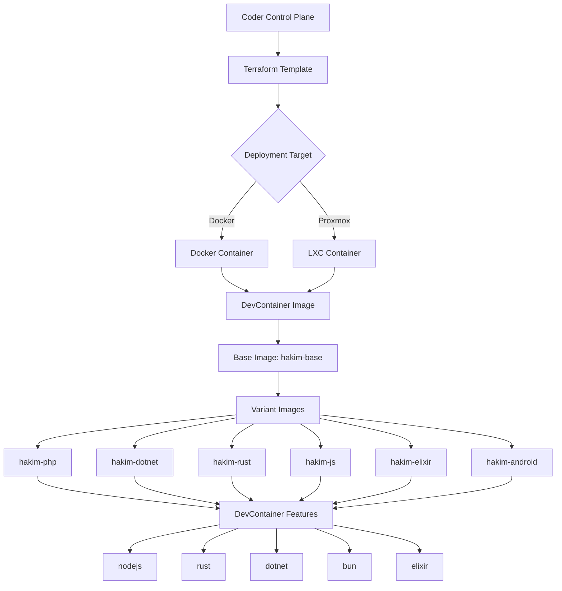
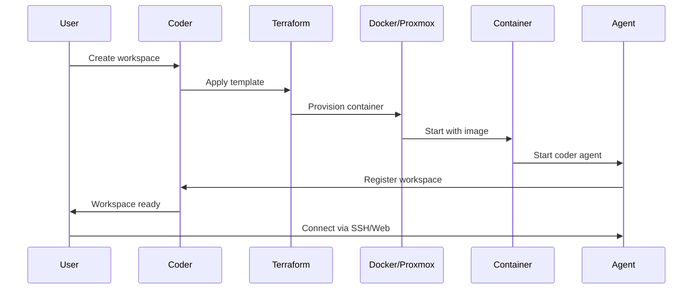
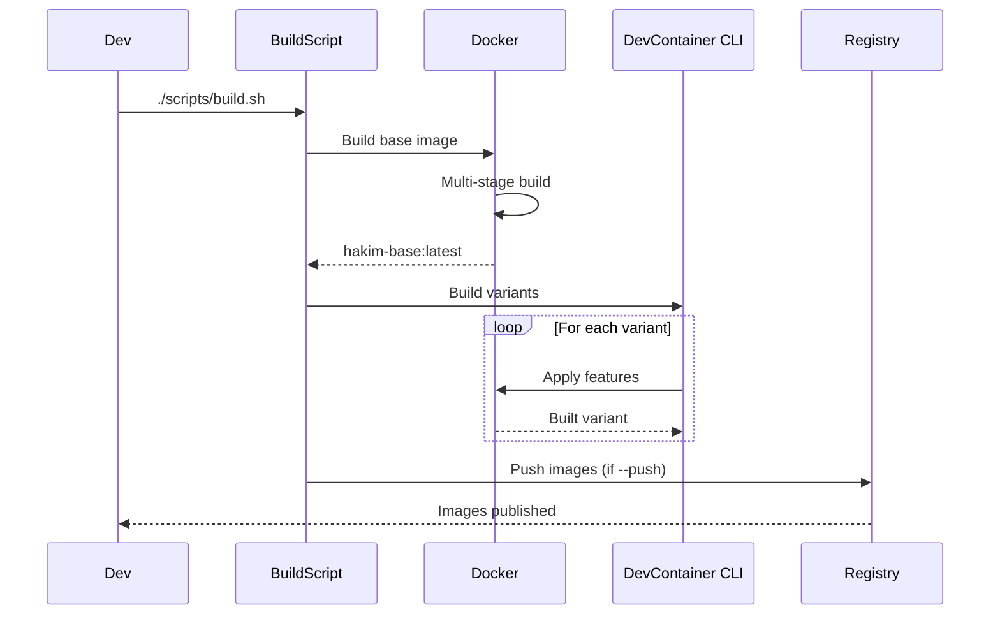

Hakim is an Infrastructure-as-Code (IaC) project that provides universal Coder workspace templates and composable DevContainer images for AI-assisted development.

## System architecture

Hakim combines two key infrastructure components:

<CardGroup cols={2}>
  <Card title="Coder templates" icon="cube" href="/architecture/coder-templates">
    Terraform-based workspace definitions that provision and configure development environments
  </Card>
  <Card title="DevContainer images" icon="docker" href="/architecture/devcontainer-images">
    Docker images built from composable features for multiple language stacks
  </Card>
</CardGroup>

## Component interaction



## Directory structure

Hakim's repository is organized into clear functional areas:

```
hakim/
├── coder/
│   ├── templates/
│   │   ├── hakim/              # Docker-based template
│   │   └── hakim-proxmox/      # Proxmox LXC template
│   └── modules/
│       ├── opencode/           # OpenCode AI integration
│       ├── et/                 # EternalTerminal SSH
│       └── git-commit-signing/ # Git signing automation
├── devcontainers/
│   ├── base/                   # Base Debian image Dockerfile
│   └── .devcontainer/
│       ├── features/src/       # Composable features
│       │   ├── nodejs/
│       │   ├── rust/
│       │   ├── dotnet/
│       │   ├── bun/
│       │   ├── elixir/
│       │   └── ...
│       └── images/             # Image variants
│           ├── php/
│           ├── dotnet/
│           ├── rust/
│           ├── js/
│           ├── elixir/
│           └── android/
└── scripts/
    ├── build.sh                # Image build automation
    ├── coder-et-proxy.sh       # ET ProxyCommand helper
    └── ...
```

## Key technologies

Hakim leverages proven infrastructure tools:

### Docker

All images are built as standard OCI containers using multi-stage Docker builds for:
- Layer caching optimization
- Minimal final image size
- Reproducible builds with snapshot-based Debian repositories

### DevContainer CLI

The official DevContainer CLI (`@devcontainers/cli`) builds features and composes them into images:
- Feature isolation and reusability
- Automatic feature dependency resolution
- Standardized metadata via `devcontainer-feature.json`

### Mise

[Mise](https://mise.jdx.dev) manages tool versions across all images:
- Consistent tool versions (Node.js, Bun, Starship, etc.)
- Single source of truth for tooling
- Per-project overrides supported

### Terraform

Coder templates use Terraform to define workspace infrastructure:
- Declarative workspace configuration
- Parameter validation and defaults
- Module composition for reusable components

### Coder

[Coder](https://coder.com) provides the workspace platform:
- Web IDE access via code-server
- SSH and port forwarding
- Resource management and scaling
- Team collaboration features

## Design principles

### Composability

DevContainer features are small, focused units that can be combined to create specialized images. This allows:
- Mixing language runtimes (e.g., Node.js + Rust)
- Reusing features across multiple variants
- Testing features independently

### Reproducibility

All image builds are pinned to specific versions:
- Debian snapshot repositories with fixed timestamps
- Explicit tool versions in `mise.toml`
- Locked dependency versions

### Flexibility

Hakim supports multiple deployment targets:
- Docker for local and cloud deployments
- Proxmox LXC for bare-metal and private cloud
- Custom images via registry overrides

### Developer experience

Workspaces include modern development tools by default:
- Starship prompt
- Zoxide for directory navigation
- fd and ripgrep for fast file/content search
- LazyVim with sensible defaults
- OpenCode AI assistant integration

## Data flow

### Workspace provisioning



### Image build flow



## Next steps

<CardGroup cols={2}>
  <Card title="DevContainer images" icon="layer-group" href="/architecture/devcontainer-images">
    Learn how images are structured and built from composable features
  </Card>
  <Card title="Coder templates" icon="file-code" href="/architecture/coder-templates">
    Understand Terraform templates and workspace configuration
  </Card>
</CardGroup>