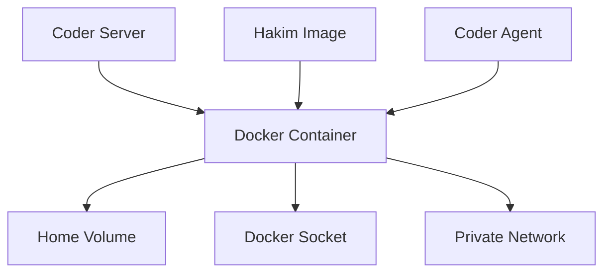

## Overview

The Hakim Docker template creates containerized development workspaces using the Docker provider. Each workspace runs as an isolated container with persistent storage, networking, and resource controls.

## Architecture



### Key components

- **Container**: Unprivileged container running selected Hakim image variant
- **Home volume**: Persistent Docker volume for `/home/coder`
- **Docker socket**: Bind-mounted from host for Docker-in-Docker
- **Private network**: Isolated bridge network per workspace
- **Resource limits**: Optional CPU and memory constraints

## Prerequisites

<Steps>
  <Step title="Install Docker">
    Docker Engine 20.10 or later must be installed on the host:
    
    ```bash
    # Ubuntu/Debian
    curl -fsSL https://get.docker.com | sh
    sudo usermod -aG docker $USER
    ```
  </Step>
  
  <Step title="Pull Hakim images">
    Pre-pull the images you plan to use:
    
    ```bash
    docker pull ghcr.io/shekohex/hakim-base:latest
    docker pull ghcr.io/shekohex/hakim-php:latest
    docker pull ghcr.io/shekohex/hakim-dotnet:latest
    docker pull ghcr.io/shekohex/hakim-js:latest
    docker pull ghcr.io/shekohex/hakim-rust:latest
    docker pull ghcr.io/shekohex/hakim-elixir:latest
    ```
  </Step>
  
  <Step title="Configure Coder">
    Add the Hakim Docker template to your Coder deployment:
    
    ```bash
    coder templates push hakim \
      --directory ~/workspace/source/coder/templates/hakim
    ```
  </Step>
</Steps>

## Available images

All images are based on Debian Trixie and include the Coder agent, Docker client, and common development tools.

| Image | Registry path | Description |
|-------|--------------|-------------|
| Base | `ghcr.io/shekohex/hakim-base:latest` | Minimal Debian Trixie with mise, Docker client, common utils |
| PHP | `ghcr.io/shekohex/hakim-php:latest` | PHP 8.4, Laravel, Node.js, Bun |
| .NET | `ghcr.io/shekohex/hakim-dotnet:latest` | .NET 10 SDK, Node.js, Bun |
| JavaScript | `ghcr.io/shekohex/hakim-js:latest` | Node.js LTS, Bun latest |
| Rust | `ghcr.io/shekohex/hakim-rust:latest` | Rust stable toolchain, Node.js, Bun |
| Elixir | `ghcr.io/shekohex/hakim-elixir:latest` | Elixir, Phoenix, PostgreSQL tools, Node.js, Bun |

## Template configuration

### Image selection

The `image_variant` parameter controls which Hakim image is used:

```hcl
data "coder_parameter" "image_variant" {
  name         = "image_variant"
  display_name = "Environment"
  default      = "base"
  type         = "string"
  
  option {
    name  = "Base (Minimal)"
    value = "base"
  }
  option {
    name  = "Laravel with PHP 8.4"
    value = "php"
  }
  # Additional variants...
}
```

The template resolves this to:

```hcl
image = "ghcr.io/shekohex/hakim-${data.coder_parameter.image_variant.value}:latest"
```

### Persistent storage

Each workspace gets a dedicated Docker volume for `/home/coder`:

```hcl
resource "docker_volume" "home_volume" {
  name = "coder-${data.coder_workspace.me.id}-home"
  
  lifecycle {
    ignore_changes = all
  }
}
```

This volume persists across container recreations and workspace rebuilds.

### Docker socket access

Docker-in-Docker is enabled via socket bind mount:

```hcl
volumes {
  container_path = "/var/run/docker.sock"
  host_path      = "/var/run/docker.sock"
  read_only      = false
}
```

The startup script grants access:

```bash
if [ -e /var/run/docker.sock ]; then
  sudo chmod 666 /var/run/docker.sock
fi
```

### Networking

Each workspace gets an isolated bridge network:

```hcl
resource "docker_network" "private_network" {
  name = "coder-${data.coder_workspace_owner.me.name}-${lower(data.coder_workspace.me.name)}"
}
```

The container can reach the host via `host.docker.internal`:

```hcl
host {
  host = "host.docker.internal"
  ip   = "host-gateway"
}
```

## Resource limits

<Note>
Resource limits are optional and disabled by default. Enable via the `enable_resource_limits` parameter.
</Note>

### Memory limit

```hcl
memory = (
  data.coder_parameter.enable_resource_limits.value &&
  data.coder_parameter.container_memory[0].value > 0
) ? data.coder_parameter.container_memory[0].value : null
```

**Example**: Set 8192 MB (8 GB) memory limit

### CPU limit

```hcl
cpus = (
  data.coder_parameter.enable_resource_limits.value &&
  tonumber(data.coder_parameter.container_cpus[0].value) > 0
) ? data.coder_parameter.container_cpus[0].value : null
```

**Example**: Set "2" for 2 cores or "1.5" for 1.5 cores

## Bootstrap process

The container entrypoint (`bootstrap.sh`) handles agent initialization:

<Steps>
  <Step title="Check for preinstalled agent">
    ```bash
    PREINSTALLED_BINARY="/usr/local/bin/coder"
    if [ -x "${PREINSTALLED_BINARY}" ]; then
      echo "Using pre-installed coder binary"
    fi
    ```
  </Step>
  
  <Step title="Download agent if needed">
    ```bash
    BINARY_URL=${ACCESS_URL}bin/coder-linux-${ARCH}
    curl -fsSL --compressed "${BINARY_URL}" -o "${BINARY_NAME}"
    chmod +x $BINARY_NAME
    ```
  </Step>
  
  <Step title="Launch agent">
    ```bash
    export CODER_AGENT_AUTH="token"
    export CODER_AGENT_URL="${CODER_AGENT_URL}"
    exec ./coder agent
    ```
  </Step>
</Steps>

## Environment variables

The template merges default, user, and secret environment variables:

```hcl
locals {
  default_env = {
    MIX_HOME     = "/home/coder/.mix"
    HEX_HOME     = "/home/coder/.hex"
    MIX_ARCHIVES = "/home/coder/.mix/archives"
  }
  
  user_env   = try(jsondecode(data.coder_parameter.user_env.value), {})
  secret_env = try(jsondecode(data.coder_parameter.secret_env.value), {})
  
  combined_env = merge(local.default_env, local.user_env, local.secret_env)
}
```

### Injecting custom variables

Provide JSON in the `user_env` parameter:

```json
{
  "DATABASE_URL": "postgresql://localhost:5432/mydb",
  "REDIS_URL": "redis://localhost:6379"
}
```

## Custom images

<Warning>
Custom images must include the Coder agent or download it in the entrypoint.
</Warning>

To use a custom image:

1. Set `image_variant` to `"custom"`
2. Provide the full image URL in `image_url`

```hcl
image = data.coder_parameter.image_variant.value == "custom" 
  ? data.coder_parameter.image_url[0].value 
  : "ghcr.io/shekohex/hakim-${data.coder_parameter.image_variant.value}:latest"
```

## Workspace presets

The template includes quick-start presets for common stacks:

```hcl
data "coder_workspace_preset" "laravel_quick" {
  name        = "Laravel Quick Start"
  description = "PHP 8.4 + Laravel for one-off tasks"
  icon        = "/icon/php.svg"
  default     = true
  
  parameters = {
    "image_variant" = "php"
    "git_url"       = ""
    "system_prompt" = "You are working on a Laravel API project. Use artisan commands."
  }
}
```

Presets are available for: Laravel, .NET, Node.js/Bun, Rust, Android, Phoenix, and Base.

## Troubleshooting

### Container fails to start

**Check Docker logs**:
```bash
docker logs coder-<owner>-<workspace>
```

**Verify image exists**:
```bash
docker pull ghcr.io/shekohex/hakim-<variant>:latest
```

### Docker socket permission denied

The startup script should auto-grant access. If it fails:

```bash
sudo chmod 666 /var/run/docker.sock
```

### Out of disk space

Check Docker disk usage:
```bash
docker system df
docker system prune -a --volumes
```

### Network issues

Verify the private network exists:
```bash
docker network ls | grep coder
docker network inspect coder-<owner>-<workspace>
```

## Advanced configuration

### Using external volumes

Replace the managed volume with an existing one:

```hcl
resource "docker_volume" "home_volume" {
  name = "my-existing-volume"
  
  lifecycle {
    prevent_destroy = true
  }
}
```

### Multiple networks

Add additional network attachments:

```hcl
networks_advanced {
  name = "shared-services-network"
}
```

### Host mounts

Bind-mount host directories:

```hcl
volumes {
  container_path = "/workspace"
  host_path      = "/mnt/shared-workspace"
  read_only      = false
}
```

## Next steps

<CardGroup>
  <Card title="Build custom images" icon="hammer" href="/deployment/building-images">
    Learn how to build and customize Hakim images
  </Card>
  <Card title="Proxmox deployment" icon="server" href="/deployment/proxmox">
    Deploy using Proxmox LXC containers
  </Card>
</CardGroup>
