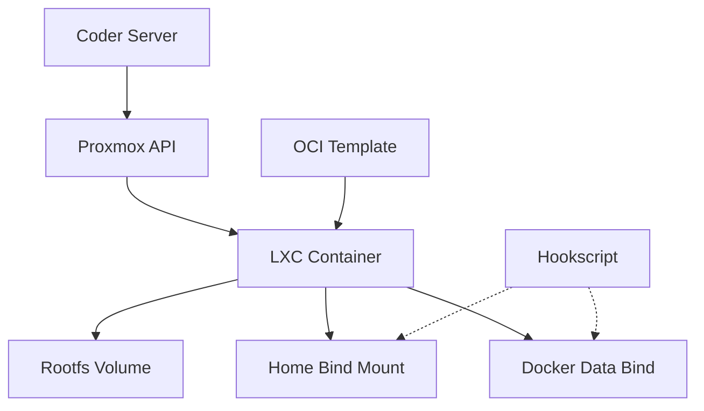

## Overview

The Hakim Proxmox template provisions workspaces as unprivileged LXC containers using the `bpg/proxmox` Terraform provider. It supports persistent storage via bind mounts, advanced networking, and OCI-derived container templates.

## Architecture



### Key components

- **LXC Container**: Unprivileged container running Hakim OCI-derived template
- **Bind mounts**: Auto-created host directories for `/home/coder` persistence
- **Hookscript**: Proxmox hook that creates bind mount directories before container start
- **Bootstrap script**: Provisioner that injects environment variables and configures mounts
- **Docker data offload**: Optional persistent storage for Docker data root

## Prerequisites

<Steps>
  <Step title="Proxmox VE installation">
    Proxmox VE 8.0 or later is required:
    
    ```bash
    # Verify Proxmox version
    pveversion
    ```
  </Step>
  
  <Step title="API token creation">
    Create a Proxmox API token for Terraform:
    
    ```bash
    # In Proxmox UI: Datacenter > Permissions > API Tokens
    # Format: user@realm!tokenid=secret
    # Example: root@pam!coder-template=abc123...
    ```
    
    <Note>
    For bind mounts, you'll also need root@pam session credentials (username + password).
    </Note>
  </Step>
  
  <Step title="Upload OCI templates">
    Convert and upload Hakim images to Proxmox template storage:
    
    ```bash
    # Pull Hakim image
    docker pull ghcr.io/shekohex/hakim-base:latest
    
    # Convert to LXC template
    docker save ghcr.io/shekohex/hakim-base:latest | \
      ssh root@proxmox \
      "cat > /var/lib/vz/template/cache/hakim-base_latest.tar"
    ```
    
    Repeat for all variants: `base`, `php`, `dotnet`, `js`, `rust`, `elixir`.
  </Step>
  
  <Step title="Install hookscript (for bind mounts)">
    If using `enable_home_disk` or `enable_docker_data_offload`, deploy the hookscript:
    
    ```bash
    # Create hookscript on Proxmox host
    cat > /var/lib/vz/snippets/hakim-home-bind-hook.sh <<'EOF'
#!/bin/bash
set -e

if [[ "$2" == "pre-start" ]]; then
  CONFIG="/etc/pve/lxc/$1.conf"
  
  grep -E '^mp[0-9]+:' "$CONFIG" | while IFS=':' read -r key rest; do
    if [[ "$rest" =~ mp=([^,]+) ]]; then
      mount_path="${BASH_REMATCH[1]}"
    fi
    
    if [[ "$rest" =~ ^/([^,]+) ]]; then
      bind_source="/${BASH_REMATCH[1]}"
      if [[ ! -d "$bind_source" ]]; then
        mkdir -p "$bind_source"
        chown 100000:100000 "$bind_source"
      fi
    fi
  done
fi
EOF
    
    chmod +x /var/lib/vz/snippets/hakim-home-bind-hook.sh
    ```
  </Step>
</Steps>

## Template configuration

### Proxmox connection

```hcl
provider "proxmox" {
  endpoint  = data.coder_parameter.proxmox_endpoint.value
  api_token = local.requires_root_session ? null : data.coder_parameter.proxmox_api_token.value
  username  = local.requires_root_session ? data.coder_parameter.proxmox_username.value : null
  password  = local.requires_root_session ? data.coder_parameter.proxmox_password.value : null
  insecure  = data.coder_parameter.proxmox_insecure.value
}
```

**Key parameters**:
- `proxmox_endpoint`: `https://pve.example.com:8006/`
- `proxmox_api_token`: `root@pam!coder-template=secret`
- `proxmox_insecure`: Skip TLS verification (useful for self-signed certs)

<Warning>
Bind mounts require root@pam session authentication. API tokens alone are insufficient.
</Warning>

### Image variant selection

Template file IDs are constructed from the datastore and variant:

```hcl
locals {
  selected_template_tag = trimspace(data.coder_parameter.template_tag[0].value)
  
  selected_template_file_id = data.coder_parameter.image_variant.value == "custom" 
    ? data.coder_parameter.custom_template_file_id[0].value 
    : "${data.coder_parameter.proxmox_template_datastore_id.value}:vztmpl/hakim-${data.coder_parameter.image_variant.value}_${local.selected_template_tag}.tar"
}
```

**Example**: `local:vztmpl/hakim-php_latest.tar`

### Container resource allocation

```hcl
resource "proxmox_virtual_environment_container" "workspace" {
  node_name = data.coder_parameter.proxmox_node_name.value
  vm_id     = data.coder_parameter.proxmox_vm_id.value > 0 
    ? data.coder_parameter.proxmox_vm_id.value 
    : null  # Auto-allocate
  
  cpu {
    cores = data.coder_parameter.container_cores.value  # Default: 2
  }
  
  memory {
    dedicated = data.coder_parameter.container_memory_mb.value  # Default: 4096
    swap      = 0
  }
  
  disk {
    datastore_id = data.coder_parameter.proxmox_container_datastore_id.value
    size         = data.coder_parameter.container_disk_gb.value  # Default: 20
  }
}
```

## Persistent storage

### Home directory persistence

Enable via `enable_home_disk` parameter:

```hcl
locals {
  home_bind_path = "/var/lib/vz/hakim-homes/${local.home_owner_slug}/${local.home_workspace_slug}"
  
  home_mount_source = local.use_existing_home_volume 
    ? local.home_volume_id 
    : local.home_bind_path
}
```

**Automatic bind mount**:
- Path: `/var/lib/vz/hakim-homes/<owner>/<workspace>`
- Auto-created by hookscript before container start
- Persists across container rebuilds

**Manual volume ID**:
Provide `proxmox_home_volume_id` to use an existing volume or custom path:

```text
local-lvm:vm-100-disk-1
```

or

```text
/mnt/storage/hakim-homes/user/workspace
```

### Docker data offload

Enable via `enable_docker_data_offload` to persist Docker data root:

```hcl
locals {
  docker_bind_path = "/tank/hakim-docker/${local.home_owner_slug}/${local.home_workspace_slug}"
  
  docker_data_root_env = data.coder_parameter.enable_docker_data_offload.value 
    ? { DOCKER_DATA_ROOT = "/home/coder/.local/share/docker" } 
    : {}
}
```

This mounts `/tank/hakim-docker/<owner>/<workspace>` to `/home/coder/.local/share/docker` and configures Docker daemon to use it.

<Note>
The container image's entrypoint reads `DOCKER_DATA_ROOT` and configures Docker accordingly.
</Note>

## Bootstrap process

The `bootstrap-agent-env.sh` provisioner runs on workspace start:

<Steps>
  <Step title="Encode environment variables">
    ```bash
    build_runtime_env_file "${CT_RUNTIME_ENV_B64}"
    # Format: KEY1=base64(value1),KEY2=base64(value2)
    ```
  </Step>
  
  <Step title="Inject via Proxmox API">
    ```bash
    api_call PUT "/api2/json/nodes/${PVE_NODE_NAME}/lxc/${PVE_VM_ID}/config" \
      --data-urlencode "env@${RUNTIME_ENV_FILE}"
    ```
    
    Includes `CODER_AGENT_BOOTSTRAP` with agent URL and token.
  </Step>
  
  <Step title="Stop container">
    ```bash
    api_call POST "/api2/json/nodes/${PVE_NODE_NAME}/lxc/${PVE_VM_ID}/status/stop"
    wait_task "${stop_upid}"
    ```
  </Step>
  
  <Step title="Upsert bind mounts">
    ```bash
    if [[ -n "${PVE_HOME_SOURCE}" ]]; then
      upsert_mount_point "${PVE_HOME_SOURCE}" "/home/coder" "0"
    fi
    
    if [[ -n "${PVE_DOCKER_SOURCE}" ]]; then
      upsert_mount_point "${PVE_DOCKER_SOURCE}" "/home/coder/.local/share/docker" "0"
    fi
    ```
    
    Finds or allocates mount point keys (`mp0`, `mp1`, etc.) and updates container config.
  </Step>
  
  <Step title="Start container">
    ```bash
    api_call POST "/api2/json/nodes/${PVE_NODE_NAME}/lxc/${PVE_VM_ID}/status/start"
    wait_task "${start_upid}"
    ```
  </Step>
</Steps>

## Networking

### Basic configuration

```hcl
initialization {
  hostname = "coder-${data.coder_workspace_owner.me.name}-${lower(data.coder_workspace.me.name)}"
  
  ip_config {
    ipv4 {
      address = "dhcp"
    }
  }
}

network_interface {
  name     = "eth0"
  bridge   = data.coder_parameter.proxmox_network_bridge.value  # Default: vmbr0
  vlan_id  = data.coder_parameter.proxmox_vlan_id.value > 0 
    ? data.coder_parameter.proxmox_vlan_id.value 
    : null
  firewall = data.coder_parameter.proxmox_network_firewall.value
}
```

### VLAN tagging

Set `proxmox_vlan_id` to a non-zero value to enable VLAN tagging:

```text
VLAN ID: 100
```

Container NIC will tag traffic with VLAN 100.

### Firewall

Enable Proxmox firewall on the NIC:

```text
Enable NIC Firewall: true
```

Firewall rules are configured in Proxmox UI under the container's network settings.

## Advanced features

### Container nesting

<Warning>
Nesting is disabled by default for security. Enable only if required for nested containers.
</Warning>

```hcl
features {
  nesting = data.coder_parameter.enable_nesting.value  # Default: false
}
```

### Workspace rebuild generation

Force container recreation to pick up template updates:

```hcl
resource "terraform_data" "workspace_rebuild_generation" {
  input = data.coder_parameter.workspace_rebuild_generation.value
  
  triggers_replace = [
    data.coder_parameter.workspace_rebuild_generation.value
  ]
}

resource "proxmox_virtual_environment_container" "workspace" {
  lifecycle {
    replace_triggered_by = [terraform_data.workspace_rebuild_generation]
  }
}
```

Increment `workspace_rebuild_generation` to trigger recreation.

### Pool assignment

Assign containers to Proxmox resource pools:

```hcl
pool_id = trimspace(data.coder_parameter.proxmox_pool_id.value) != ""
  ? data.coder_parameter.proxmox_pool_id.value
  : null
```

### Container tags

```hcl
tags = [
  "coder",
  "hakim",
  data.coder_parameter.image_variant.value,
  data.coder_parameter.egress_mode.value,
  "template-${local.selected_template_tag}"
]
```

Tags are visible in Proxmox UI for filtering and organization.

## Troubleshooting

### Container fails to start

**Check Proxmox logs**:
```bash
pct list
pct status <vmid>
journalctl -u pve-container@<vmid>
```

**Verify template exists**:
```bash
pvesm list local --content vztmpl
```

### Bind mount not created

**Verify hookscript**:
```bash
cat /var/lib/vz/snippets/hakim-home-bind-hook.sh
chmod +x /var/lib/vz/snippets/hakim-home-bind-hook.sh
```

**Check container config**:
```bash
cat /etc/pve/lxc/<vmid>.conf | grep hookscript
cat /etc/pve/lxc/<vmid>.conf | grep mp
```

### Permission denied in container

Bind mount directories must be owned by subuid 100000:

```bash
chown -R 100000:100000 /var/lib/vz/hakim-homes/<owner>/<workspace>
```

### API authentication fails

**For API token auth**:
```bash
curl -k "https://pve.example.com:8006/api2/json/nodes" \
  -H "Authorization: PVEAPIToken=root@pam!coder-template=secret"
```

**For session auth (bind mounts)**:
```bash
curl -k -X POST "https://pve.example.com:8006/api2/json/access/ticket" \
  --data-urlencode "username=root@pam" \
  --data-urlencode "password=yourpassword"
```

### Out of disk space

Check container disk usage:
```bash
pct exec <vmid> -- df -h
```

Resize root disk:
```bash
pct resize <vmid> rootfs +10G
```

## Comparison with Docker deployment

| Feature | Docker | Proxmox LXC |
|---------|--------|-------------|
| Isolation | Container | Container (system-level) |
| Performance | Good | Excellent (near-native) |
| Storage | Docker volumes | LXC volumes or bind mounts |
| Networking | Bridge networks | Proxmox SDN, VLANs |
| Resource limits | cgroups | cgroups + Proxmox controls |
| Management | Docker CLI | Proxmox UI + pct CLI |
| Overhead | Moderate | Minimal |
| Snapshot support | Docker commit | Proxmox snapshots |

## Migration from Docker

<Steps>
  <Step title="Convert images to templates">
    ```bash
    for variant in base php dotnet js rust elixir; do
      docker pull ghcr.io/shekohex/hakim-$variant:latest
      docker save ghcr.io/shekohex/hakim-$variant:latest | \
        ssh root@proxmox "cat > /var/lib/vz/template/cache/hakim-${variant}_latest.tar"
    done
    ```
  </Step>
  
  <Step title="Export Docker volumes">
    ```bash
    docker run --rm -v coder-<workspace-id>-home:/data \
      -v $(pwd):/backup alpine tar czf /backup/home.tar.gz -C /data .
    ```
  </Step>
  
  <Step title="Import to Proxmox bind mount">
    ```bash
    mkdir -p /var/lib/vz/hakim-homes/<owner>/<workspace>
    tar xzf home.tar.gz -C /var/lib/vz/hakim-homes/<owner>/<workspace>
    chown -R 100000:100000 /var/lib/vz/hakim-homes/<owner>/<workspace>
    ```
  </Step>
  
  <Step title="Update workspace template">
    Change template from `hakim` to `hakim-proxmox` and configure parameters.
  </Step>
</Steps>

## Next steps

<CardGroup>
  <Card title="Build custom images" icon="hammer" href="/deployment/building-images">
    Learn how to build and convert custom Hakim images
  </Card>
  <Card title="Docker deployment" icon="docker" href="/deployment/docker">
    Compare with Docker-based deployment
  </Card>
</CardGroup>
