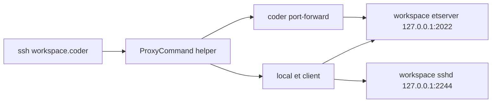

## What is Hakim?

Hakim provides Terraform-based Coder templates and prebuilt DevContainer images for AI-assisted development across multiple language stacks. Built for developers who want production-ready workspaces with zero configuration.

<CardGroup cols={2}>
  <Card
    title="Universal templates"
    icon="box"
    href="#templates"
  >
    Docker and Proxmox-ready Coder templates with OpenCode integration
  </Card>
  <Card
    title="DevContainer images"
    icon="docker"
    href="#images"
  >
    Prebuilt images for PHP, .NET, Rust, JavaScript, Elixir, and Android
  </Card>
  <Card
    title="Resilient SSH"
    icon="terminal"
    href="#resilient-ssh"
  >
    EternalTerminal-powered SSH that survives network interruptions
  </Card>
  <Card
    title="AI agent integration"
    icon="robot"
    href="#opencode-integration"
  >
    Built-in OpenCode AI agent with web UI and task integration
  </Card>
</CardGroup>

## Templates

Hakim includes two Terraform-based Coder templates:

- **Docker template**: `coder/templates/hakim` - Runs workspaces as Docker containers
- **Proxmox template**: `coder/templates/hakim-proxmox` - Runs workspaces as LXC containers on Proxmox

Both templates share the same parameter interface and support all image variants. The Proxmox template pre-pulls images into `vztmpl` storage and persists `/home/coder` with Docker data at `/home/coder/.local/share/docker` to survive container rebuilds.

### Template parameters

All templates support these core parameters:

| Parameter | Description | Default |
| :--- | :--- | :--- |
| `image_variant` | Workspace image variant | `base` |
| `git_repo_url` | Repository to clone on startup | `""` |
| `opencode_auth` | OpenCode auth JSON | `{}` |
| `opencode_config` | OpenCode config JSON | `{}` |
| `default_env` / `secret_env` | Environment variable injection | `{}` |
| `preview_port` | Preview app port | `3000` |
| `setup_script` | Startup shell script | `""` |
| `enable_et` | Enable ET-based resilient SSH transport | `true` |

<Note>
  The `image_variant` parameter determines which DevContainer image your workspace uses. Choose from `base`, `php`, `dotnet`, `rust`, `js`, `android`, `elixir`, or provide a custom image URL.
</Note>

## Images

All DevContainer images follow the DevContainer Features model and are OCI-ready for Proxmox LXC usage. The base image can run `coder agent` directly through `CODER_AGENT_URL` and `CODER_AGENT_TOKEN`.

### Available variants

| Image | Variant | Key tooling | Description |
| :--- | :--- | :--- | :--- |
| `hakim-base` | Base | `mise`, common utils | Minimal Debian Trixie image with Docker client and core tooling. |
| `hakim-php` | PHP | `php:8.4`, `laravel`, `nodejs`, `bun` | Laravel-focused workspace with PHP and JS runtimes. |
| `hakim-dotnet` | .NET | `dotnet:10`, `dotnet:latest`, `nodejs`, `bun` | .NET SDKs with JS runtimes. |
| `hakim-rust` | Rust | `rust:stable`, `nodejs`, `bun` | Rust toolchain with JS runtimes. |
| `hakim-js` | JS | `nodejs:lts`, `bun:latest` | JavaScript workspace with Node.js LTS and Bun. |
| `hakim-elixir` | Elixir | `elixir`, `phoenix`, `postgresql-tools`, `nodejs`, `bun` | Elixir/Phoenix workspace with PostgreSQL client tools and JS runtimes. |
| `hakim-android` | Android | `android-sdk`, `android-ndk`, `java:17` | Android SDK, NDK r29, and modern build tooling. |

### Base image architecture

The base image (`hakim-base`) is built on Debian Trixie (slim) and includes:

- **Docker client**: Full Docker CLI with compose and buildx plugins
- **Coder CLI**: Version 2.29.7
- **Code Server**: Version 4.109.2
- **Chrome for Testing**: Version 146.0.7680.31 with chromedriver
- **Mise**: Universal tooling manager for version management
- **EternalTerminal**: Server and client for resilient SSH
- **Git credential helper**: libsecret support for secure credential storage
- **Starship prompt**: Modern shell prompt with git integration

<CodeGroup>
```dockerfile Dockerfile (base image excerpt)
FROM debian:trixie-slim

# Install system packages
RUN apt-get update && apt-get install -y --no-install-recommends \
  curl wget jq unzip sudo bash bash-completion htop locales \
  ca-certificates gnupg lsb-release git lsof \
  build-essential gawk procps openssh-client

# Install mise for tool version management
COPY install-mise.sh /tmp/
RUN MISE_VERSION=2026.2.1 bash /tmp/install-mise.sh

# Copy Docker CLI
COPY --from=docker-cli /usr/local/bin/docker /usr/local/bin/
COPY --from=docker-compose-downloader /downloads/docker-compose /usr/local/lib/docker/cli-plugins/docker-compose
COPY --from=docker-buildx-downloader /downloads/docker-buildx /usr/local/lib/docker/cli-plugins/docker-buildx
```

```bash mise.toml (tool versions)
[tools]
ghcli = "latest"
node = "lts"
bun = "latest"
starship = "latest"
nvim = "stable"
lazygit = "latest"
ripgrep = "latest"
fd = "latest"
bat = "latest"
```
</CodeGroup>

## Resilient SSH

With `enable_et` enabled by default, workspace services run on loopback only:

- `etserver` on `127.0.0.1:2022`
- `sshd` on `127.0.0.1:2244`

This architecture provides resilient SSH sessions that survive network interruptions, laptop sleep, and WiFi changes.



### Local prerequisites

Required on your local machine:

- `coder` CLI
- `et` (EternalTerminal client)
- `nc` (netcat)

<CodeGroup>
```bash macOS (Homebrew)
brew install coder/coder/coder MisterTea/et/et netcat
```

```bash Debian/Ubuntu
# Install Coder CLI per official docs, then:
sudo apt-get update
sudo apt-get install -y netcat-openbsd curl

# ET official Debian repo
sudo mkdir -m 0755 -p /etc/apt/keyrings
echo "deb [signed-by=/etc/apt/keyrings/et.gpg] https://mistertea.github.io/debian-et/debian-source/ $(grep VERSION_CODENAME /etc/os-release | cut -d= -f2) main" | sudo tee /etc/apt/sources.list.d/et.list
curl -sSL https://github.com/MisterTea/debian-et/raw/master/et.gpg | sudo tee /etc/apt/keyrings/et.gpg >/dev/null
sudo apt-get update
sudo apt-get install -y et
```
</CodeGroup>

### SSH configuration

Add this to your `~/.ssh/config`:

```sshconfig
Host coder.* *.coder
  User coder
  IdentitiesOnly yes
  IdentityFile ~/.ssh/coder-keys/%h/id_ed25519
  StrictHostKeyChecking accept-new
  UserKnownHostsFile ~/.ssh/coder_known_hosts
  ProxyCommand ~/.ssh/scripts/coder-et-proxy.sh %h %p %r
```

Download the proxy script:

```bash
mkdir -p ~/.ssh/scripts ~/.ssh/coder-keys
curl -fsSL https://raw.githubusercontent.com/shekohex/hakim/main/scripts/coder-et-proxy.sh -o ~/.ssh/scripts/coder-et-proxy.sh
chmod 0755 ~/.ssh/scripts/coder-et-proxy.sh
chmod 700 ~/.ssh/scripts ~/.ssh/coder-keys
```

<Note>
  Keys are ed25519-only and stored per-workspace under `~/.ssh/coder-keys/<workspace>/id_ed25519`. Keys rotate automatically based on TTL (default 3600 seconds).
</Note>

## OpenCode integration

Every workspace includes [OpenCode](https://opencode.ai), an AI coding assistant with embedded web UI on port 4096. OpenCode integrates with Coder's AI Tasks feature for autonomous task execution.

### Features

- **Web UI**: Access OpenCode at `http://localhost:4096` or via Coder app
- **CLI access**: Use the `oca` command to attach OpenCode from terminal
- **Task integration**: Link OpenCode to Coder Tasks UI for autonomous workflows
- **MCP support**: Task reporting via Model Context Protocol

### Configuration

Configure OpenCode through template parameters:

```hcl
data "coder_parameter" "opencode_auth" {
  name         = "opencode_auth"
  display_name = "OpenCode Auth JSON"
  description  = "Paste content of ~/.local/share/opencode/auth.json"
  form_type    = "textarea"
  type         = "string"
  default      = "{}"
  mutable      = true
  styling      = jsonencode({ mask_input = true })
}

data "coder_parameter" "opencode_config" {
  name         = "opencode_config"
  display_name = "OpenCode Config JSON"
  description  = "OpenCode JSON config. https://opencode.ai/docs/config/"
  type         = "string"
  form_type    = "textarea"
  default      = "{}"
  mutable      = true
}
```

<Warning>
  You must provide valid authentication credentials in `opencode_auth` for OpenCode to function. Obtain your auth.json from `~/.local/share/opencode/auth.json` after running `opencode login` locally.
</Warning>

## Next steps

<CardGroup cols={2}>
  <Card
    title="Quickstart"
    icon="rocket"
    href="/quickstart"
  >
    Get your first Hakim workspace running in minutes
  </Card>
  <Card
    title="Installation"
    icon="download"
    href="/installation"
  >
    Complete setup guide with prerequisites and configuration
  </Card>
</CardGroup>
