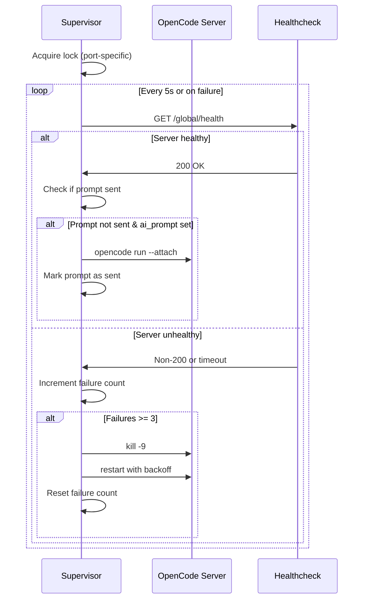

The OpenCode module runs the [OpenCode AI coding assistant](https://opencode.ai) directly in your Coder workspace, providing an embedded web UI and optional task reporting integration.

## Overview

OpenCode is installed and configured automatically when you create a workspace. The module:

- Installs OpenCode CLI via Bun or the official installer
- Configures authentication from your auth.json
- Sets up MCP (Model Context Protocol) for Coder task reporting
- Runs `opencode serve` with automatic restart/healthcheck supervision
- Exposes web UI on port 4096 (configurable)

<Info>
  The OpenCode module includes a supervisor that automatically restarts the server if it crashes and sends initial prompts when configured.
</Info>

## Quick start

### Basic configuration

The OpenCode module requires minimal configuration:

```tf
module "opencode" {
  source   = "github.com/shekohex/hakim//coder/modules/opencode?ref=main"
  agent_id = coder_agent.main.id
  workdir  = "/home/coder/project"
}
```

### With authentication

For non-interactive authentication, provide your auth credentials:

```tf
module "opencode" {
  source   = "github.com/shekohex/hakim//coder/modules/opencode?ref=main"
  agent_id = coder_agent.main.id
  workdir  = "/home/coder/project"
  
  auth_json = <<-EOT
{
  "anthropic": {
    "type": "api",
    "key": "sk-ant-api03-xxx"
  }
}
EOT

  config_json = jsonencode({
    "$schema" = "https://opencode.ai/config.json"
    model     = "anthropic/claude-sonnet-4-20250514"
  })
}
```

<Warning>
  Store sensitive credentials in Coder parameter secrets, not plain text in your template.
</Warning>

### With Coder AI tasks

Integrate with Coder's AI task system for progress reporting:

```tf
resource "coder_ai_task" "task" {
  app_id = module.opencode.task_app_id
}

module "opencode" {
  source       = "github.com/shekohex/hakim//coder/modules/opencode?ref=main"
  agent_id     = coder_agent.main.id
  workdir      = "/home/coder/project"
  ai_prompt    = coder_ai_task.task.prompt
  report_tasks = true
  
  auth_json   = var.opencode_auth
  config_json = var.opencode_config
}
```

## Module variables

### Required variables

| Name | Description | Type |
|------|-------------|------|
| `agent_id` | Coder agent ID | `string` |
| `workdir` | Working directory for OpenCode | `string` |

### Authentication variables

| Name | Description | Default |
|------|-------------|--------|
| `auth_json` | OpenCode auth.json content | `""` |
| `config_json` | OpenCode configuration JSON | `""` |

### Installation variables

| Name | Description | Default |
|------|-------------|--------|
| `install_opencode` | Whether to install OpenCode | `true` |
| `opencode_version` | Version to install | `"1.2.15"` |
| `pre_install_script` | Script to run before installation | `null` |
| `post_install_script` | Script to run after installation | `null` |

### Server variables

| Name | Description | Default |
|------|-------------|--------|
| `port` | Web server port | `4096` |
| `hostname` | Web server hostname | `0.0.0.0` |
| `subdomain` | Use subdomain for web app | `true` |

### Task & session variables

| Name | Description | Default |
|------|-------------|--------|
| `report_tasks` | Enable MCP task reporting to Coder | `true` |
| `ai_prompt` | Initial task prompt | `""` |
| `continue` | Continue last session | `false` |
| `session_id` | Specific session to continue | `""` |

### App configuration

| Name | Description | Default |
|------|-------------|--------|
| `cli_app` | Create CLI app in addition to web | `false` |
| `web_app_display_name` | Display name for web app | `"OpenCode"` |
| `cli_app_display_name` | Display name for CLI app | `"OpenCode CLI"` |
| `icon` | Icon for apps | `"/icon/opencode.svg"` |
| `order` | App display order | `null` |
| `group` | App group name | `null` |

## Installation process

The module's install script (`coder/modules/opencode/scripts/install.sh`) follows this workflow:

<Steps>
  <Step title="Pre-install hook">
    Runs custom `pre_install_script` if provided
  </Step>
  
  <Step title="OpenCode configuration">
    Creates config directories:
    - `~/.config/opencode/` for opencode.jsonc
    - `~/.local/share/opencode/` for auth.json
  </Step>
  
  <Step title="Auth setup">
    Writes `auth_json` parameter to `~/.local/share/opencode/auth.json`
  </Step>
  
  <Step title="MCP configuration">
    If `report_tasks=true`, adds Coder MCP server to opencode.jsonc:
    
    ```json
    {
      "mcp": {
        "coder": {
          "type": "local",
          "command": ["coder", "exp", "mcp", "server"],
          "enabled": true,
          "environment": {
            "CODER_MCP_APP_STATUS_SLUG": "opencode",
            "CODER_MCP_ALLOWED_TOOLS": "coder_report_task"
          }
        }
      }
    }
    ```
  </Step>
  
  <Step title="OpenCode installation">
    Installs OpenCode via Bun (if available) or official installer:
    
    ```bash
    # Via Bun (preferred)
    bun add -g opencode-ai@1.2.15
    
    # Via installer (fallback)
    curl -fsSL https://opencode.ai/install | bash
    ```
  </Step>
  
  <Step title="Symlink creation">
    Creates `/usr/local/bin/opencode` symlink for global access
  </Step>
  
  <Step title="Post-install hook">
    Runs custom `post_install_script` if provided
  </Step>
</Steps>

## Server supervision

The start script (`coder/modules/opencode/scripts/start.sh`) implements a robust supervision system:

### Supervisor features

- **Automatic restart** - Restarts server if it crashes
- **Healthcheck monitoring** - Polls `http://localhost:4096/global/health` every 5 seconds
- **Exponential backoff** - 1s → 2s → 4s → ... → 30s max between restarts
- **Lock-based coordination** - Prevents duplicate supervisors via flock/mkdir lock
- **Initial prompt injection** - Sends `ai_prompt` when server becomes healthy

### Supervisor workflow



### Server logs

Logs are written to `/tmp/` inside the workspace:

```bash
# Supervisor main log
tail -f /tmp/opencode-supervisor.log

# OpenCode server output
tail -f /tmp/opencode-serve.log

# Initial prompt injection log
tail -f /tmp/opencode-prompt.log
```

## Task reporting with MCP

When `report_tasks=true`, OpenCode can report progress to Coder's UI via the MCP protocol.

### How it works

<Steps>
  <Step title="MCP server registration">
    Install script adds `coder` MCP server to opencode.jsonc
  </Step>
  
  <Step title="Tool availability">
    OpenCode gains access to `coder_report_task` tool
  </Step>
  
  <Step title="Task reporting">
    AI can call tool to update task status in Coder UI:
    
    ```json
    {
      "tool": "coder_report_task",
      "arguments": {
        "status": "in_progress",
        "summary": "Implementing authentication layer"
      }
    }
    ```
  </Step>
  
  <Step title="UI update">
    Coder web UI shows live task progress and summary
  </Step>
</Steps>

### Environment variables

The Coder MCP server receives these from the workspace environment:

- `CODER_MCP_APP_STATUS_SLUG` - App ID for status updates (set to `"opencode"`)
- `CODER_AGENT_URL` - Automatically provided by Coder
- `CODER_AGENT_TOKEN` - Automatically provided by Coder
- `CODER_MCP_ALLOWED_TOOLS` - Restricted to `"coder_report_task"`

<Info>
  Task reporting requires Coder version 2.13+ with experimental MCP support enabled.
</Info>

## Hakim template integration

The main Hakim Docker template (`coder/templates/hakim/main.tf`) includes these OpenCode parameters:

### Template parameters

```hcl
data "coder_parameter" "opencode_auth" {
  name         = "opencode_auth"
  display_name = "OpenCode Auth JSON"
  description  = "Paste content of ~/.local/share/opencode/auth.json"
  form_type    = "textarea"
  type         = "string"
  default      = "{}"
  mutable      = true
  styling      = jsonencode({ mask_input = true })
  icon         = "/icon/opencode.svg"
}

data "coder_parameter" "opencode_config" {
  name         = "opencode_config"
  display_name = "OpenCode Config JSON"
  description  = "OpenCode JSON config. https://opencode.ai/docs/config/"
  type         = "string"
  form_type    = "textarea"
  default      = "{}"
  mutable      = true
  icon         = "/icon/opencode.svg"
}
```

### Module instantiation

Workspaces automatically include OpenCode with Coder AI task integration.

## CLI mode

For terminal-only workflows, enable CLI app mode:

```tf
module "opencode" {
  source       = "github.com/shekohex/hakim//coder/modules/opencode?ref=main"
  agent_id     = coder_agent.main.id
  workdir      = "/home/coder"
  report_tasks = false
  cli_app      = true
}
```

This creates a Coder app that runs `opencode` in interactive CLI mode.

<Warning>
  CLI mode doesn't include the supervisor or web UI. The command runs directly in your terminal.
</Warning>

## Custom workflows

### Pre-install script example

Install additional dependencies before OpenCode:

```tf
module "opencode" {
  source   = "github.com/shekohex/hakim//coder/modules/opencode?ref=main"
  agent_id = coder_agent.main.id
  workdir  = "/home/coder/project"
  
  pre_install_script = <<-EOF
    #!/bin/bash
    set -euo pipefail
    
    # Install custom tools
    sudo apt-get update
    sudo apt-get install -y ripgrep fd-find
    
    echo "Pre-install complete"
  EOF
}
```

### Post-install script example

Configure workspace-specific settings:

```tf
module "opencode" {
  source   = "github.com/shekohex/hakim//coder/modules/opencode?ref=main"
  agent_id = coder_agent.main.id
  workdir  = "/home/coder/project"
  
  post_install_script = <<-EOF
    #!/bin/bash
    set -euo pipefail
    
    # Create project-specific OpenCode config
    mkdir -p /home/coder/project/.opencode
    cat > /home/coder/project/.opencode/config.json <<'JSON'
    {
      "model": "anthropic/claude-sonnet-4-20250514",
      "rules": [
        "Always write tests for new functions"
      ]
    }
    JSON
    
    echo "Project config created"
  EOF
}
```

## Troubleshooting

### OpenCode won't start

<Steps>
  <Step title="Check installation">
    ```bash
    which opencode
    opencode --version
    ```
  </Step>
  
  <Step title="Review install logs">
    Look for errors during installation:
    ```bash
    # Check Coder startup script logs
    coder workspace logs <workspace-name>
    ```
  </Step>
  
  <Step title="Verify auth.json">
    ```bash
    cat ~/.local/share/opencode/auth.json
    ```
    
    Should contain valid provider credentials.
  </Step>
  
  <Step title="Check supervisor logs">
    ```bash
    tail -100 /tmp/opencode-supervisor.log
    tail -100 /tmp/opencode-serve.log
    ```
  </Step>
</Steps>

### Healthcheck failures

If the supervisor shows repeated healthcheck failures:

```bash
# Test healthcheck manually
curl http://localhost:4096/global/health

# Should return 200 OK when healthy
```

Common causes:
- Port 4096 already in use
- OpenCode server crashed during startup
- Network/firewall blocking localhost connections

### Task reporting not working

<AccordionGroup>
  <Accordion title="Verify MCP configuration">
    Check that opencode.jsonc includes the Coder MCP server:
    
    ```bash
    cat ~/.config/opencode/opencode.jsonc | jq '.mcp.coder'
    ```
  </Accordion>
  
  <Accordion title="Check Coder version">
    Task reporting requires Coder 2.13+:
    
    ```bash
    coder version
    ```
  </Accordion>
  
  <Accordion title="Verify environment variables">
    Inside workspace:
    
    ```bash
    env | grep CODER_
    ```
    
    Should show `CODER_AGENT_URL` and `CODER_AGENT_TOKEN`.
  </Accordion>
</AccordionGroup>

### Initial prompt not sent

If `ai_prompt` is configured but not delivered:

1. Check supervisor log: `tail /tmp/opencode-supervisor.log`
2. Verify prompt state file: `ls -la /tmp/opencode-prompt-sent-*`
3. Review prompt log: `cat /tmp/opencode-prompt.log`

The supervisor waits for healthcheck success before sending the prompt.

## Advanced configuration

### Multiple OpenCode instances

Run OpenCode on different ports for different projects:

```tf
module "opencode_frontend" {
  source   = "github.com/shekohex/hakim//coder/modules/opencode?ref=main"
  agent_id = coder_agent.main.id
  workdir  = "/home/coder/frontend"
  port     = 4096
}

module "opencode_backend" {
  source   = "github.com/shekohex/hakim//coder/modules/opencode?ref=main"
  agent_id = coder_agent.main.id
  workdir  = "/home/coder/backend"
  port     = 4097
}
```

### Custom model configuration

Configure different models per workspace:

```tf
module "opencode" {
  source   = "github.com/shekohex/hakim//coder/modules/opencode?ref=main"
  agent_id = coder_agent.main.id
  workdir  = "/home/coder/project"
  
  config_json = jsonencode({
    "$schema" = "https://opencode.ai/config.json"
    model     = "anthropic/claude-sonnet-4-20250514"
    rules     = [
      "Always use TypeScript for new files",
      "Write comprehensive JSDoc comments",
      "Follow the existing code style"
    ]
    mcp = {
      filesystem = {
        type    = "local"
        command = ["npx", "-y", "@modelcontextprotocol/server-filesystem", "/home/coder/project"]
        enabled = true
      }
    }
  })
}
```

## References

- [OpenCode Documentation](https://opencode.ai/docs)
- [OpenCode Configuration Reference](https://opencode.ai/docs/config/)
- [Coder AI Agents Guide](https://coder.com/docs/tutorials/ai-agents)
- [Model Context Protocol (MCP)](https://spec.modelcontextprotocol.io/)
- [OpenCode Module Source](https://github.com/shekohex/hakim/tree/main/coder/modules/opencode)