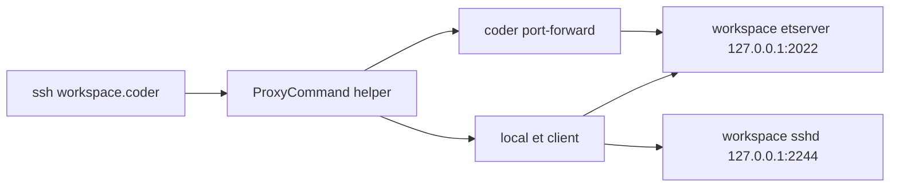

Hakim provides resilient SSH transport using [EternalTerminal (ET)](https://mistertea.github.io/EternalTerminal/), enabling SSH sessions that survive laptop sleep, network changes, and transient disconnections.

## How it works

The ET module runs two loopback services inside your workspace:

- **etserver** on `127.0.0.1:2022` - Provides the resilient transport layer
- **sshd** on `127.0.0.1:2244` - Hardened SSH daemon for actual shell access

A local ProxyCommand helper script (`coder-et-proxy.sh`) orchestrates the connection flow, allowing you to use familiar `ssh <workspace>.coder` commands while benefiting from ET's resilience.

### Connection architecture



### Connection sequence

<Steps>
  <Step title="SSH invocation">
    Developer runs `ssh myws.coder` on their local machine
  </Step>
  
  <Step title="ProxyCommand activation">
    OpenSSH invokes `~/.ssh/scripts/coder-et-proxy.sh` with workspace details
  </Step>
  
  <Step title="Key management">
    Helper ensures a per-workspace ed25519 key exists and rotates it based on TTL
  </Step>
  
  <Step title="Key injection">
    Public key is added to workspace `~/.ssh/authorized_keys` via `coder ssh`
  </Step>
  
  <Step title="Port forwarding">
    Helper starts `coder port-forward` for ET (2022) and SSH (2244) ports
  </Step>
  
  <Step title="ET tunnel">
    Helper starts local `et` client with `-N` flag to tunnel SSH traffic
  </Step>
  
  <Step title="Connection handshake">
    ET client connects to workspace etserver via forwarded port 2022
  </Step>
  
  <Step title="SSH stream">
    Helper executes `nc 127.0.0.1 <local-proxy-port>` to bridge SSH stdio
  </Step>
</Steps>

## Developer setup

### Prerequisites

Install these tools on your local machine (laptop/workstation):

<Tabs>
  <Tab title="macOS">
    ```bash
    brew install coder/coder/coder MisterTea/et/et netcat
    ```
  </Tab>
  
  <Tab title="Debian/Ubuntu">
    Install Coder CLI following the [official docs](https://coder.com/docs), then:
    
    ```bash
    sudo apt-get update
    sudo apt-get install -y netcat-openbsd curl
    
    # Add ET official repository
    sudo mkdir -m 0755 -p /etc/apt/keyrings
    echo "deb [signed-by=/etc/apt/keyrings/et.gpg] https://mistertea.github.io/debian-et/debian-source/ $(grep VERSION_CODENAME /etc/os-release | cut -d= -f2) main" | sudo tee /etc/apt/sources.list.d/et.list
    curl -sSL https://github.com/MisterTea/debian-et/raw/master/et.gpg | sudo tee /etc/apt/keyrings/et.gpg >/dev/null
    sudo apt-get update
    sudo apt-get install -y et
    ```
  </Tab>
</Tabs>

### Install ProxyCommand helper

Download and configure the helper script:

```bash
mkdir -p ~/.ssh/scripts ~/.ssh/coder-keys
curl -fsSL https://raw.githubusercontent.com/shekohex/hakim/main/scripts/coder-et-proxy.sh \
  -o ~/.ssh/scripts/coder-et-proxy.sh
chmod 0755 ~/.ssh/scripts/coder-et-proxy.sh
chmod 700 ~/.ssh/scripts ~/.ssh/coder-keys
```

### Configure SSH

Add this to your `~/.ssh/config`:

```sshconfig
Host coder.* *.coder
  User coder
  IdentitiesOnly yes
  IdentityFile ~/.ssh/coder-keys/%h/id_ed25519
  StrictHostKeyChecking accept-new
  UserKnownHostsFile ~/.ssh/coder_known_hosts
  ProxyCommand ~/.ssh/scripts/coder-et-proxy.sh %h %p %r
```

<Info>
  The `%h` (hostname), `%p` (port), and `%r` (remote user) tokens are automatically expanded by OpenSSH.
</Info>

## Workspace configuration

The ET module is enabled by default in Hakim templates. When creating a workspace, you'll see:

- **Enable EternalTerminal** parameter (default: `true`)
- Starts etserver on `127.0.0.1:2022`
- Starts sshd on `127.0.0.1:2244`

### Module reference

The ET module is located at `coder/modules/et/main.tf` and includes:

| Variable | Description | Default |
|----------|-------------|--------|
| `agent_id` | Coder agent ID | required |
| `et_port` | Port for etserver | `2022` |
| `ssh_port` | Port for internal sshd | `2244` |
| `bind_ip` | Bind address | `127.0.0.1` |
| `ssh_user` | Allowed SSH user | `coder` |

### Security configuration

The internal sshd uses hardened settings:

```ini
Port 2244
ListenAddress 127.0.0.1
AllowUsers coder
PubkeyAuthentication yes
AuthenticationMethods publickey
PasswordAuthentication no
KbdInteractiveAuthentication no
PermitRootLogin no
StrictModes no
UsePAM no
```

<Warning>
  Both etserver and sshd bind to `127.0.0.1` only, preventing unintended external exposure.
</Warning>

## Key management

### Key rotation

Keys are automatically rotated based on `CODER_ET_KEY_TTL_SECONDS` (default: 3600 seconds):

- Key type: ed25519 only (no RSA)
- Storage: `~/.ssh/coder-keys/<workspace>/id_ed25519`
- Comment format: `hakim-et:<workspace>:<timestamp>`
- Rotation triggers helper to restart ET tunnel with new key

### Key lifecycle

<Steps>
  <Step title="Generation">
    On first connection or after TTL expires, helper generates new ed25519 key pair
  </Step>
  
  <Step title="Injection">
    Public key is added to workspace `~/.ssh/authorized_keys` with marker prefix
  </Step>
  
  <Step title="Cleanup">
    Old keys with same workspace prefix are removed from authorized_keys
  </Step>
  
  <Step title="Tunnel restart">
    If key rotated, local ET tunnel is stopped and restarted with new key
  </Step>
</Steps>

### Environment variables

Customize local behavior:

```bash
# Key rotation interval (seconds, 0 = never rotate)
export CODER_ET_KEY_TTL_SECONDS=3600

# Custom key storage location
export CODER_ET_KEYS_DIR="$HOME/.ssh/coder-keys"

# Custom known_hosts file
export CODER_ET_KNOWN_HOSTS_FILE="$HOME/.ssh/coder_known_hosts"

# Connection timeout (seconds)
export CODER_ET_STARTUP_TIMEOUT_SECONDS=8
```

## Troubleshooting

### Check helper logs

The ProxyCommand helper writes logs to `~/.local/state/hakim-et/<workspace>/`:

```bash
# Port forward log
tail -f ~/.local/state/hakim-et/myws/port-forward.log

# ET client log
tail -f ~/.local/state/hakim-et/myws/et.log

# Setup/bootstrap log
cat ~/.local/state/hakim-et/myws/setup.log
```

### Check workspace services

Inside your workspace:

```bash
# Check if etserver is running
ps aux | grep etserver

# Check if internal sshd is running
ps aux | grep sshd

# View ET logs
cat ~/.local/share/hakim-et/et.log

# View sshd logs
cat ~/.local/share/hakim-et/sshd.log
```

### Common issues

<AccordionGroup>
  <Accordion title="Connection falls back to coder ssh --stdio">
    This indicates ET is unavailable. Check:
    
    - Local prerequisites installed (`et`, `nc`, `coder`)
    - Workspace ET module is enabled
    - Workspace etserver/sshd services are running
    - Port forward logs for errors
  </Accordion>
  
  <Accordion title="Key authentication fails">
    Verify:
    
    - Key exists at `~/.ssh/coder-keys/<workspace>/id_ed25519`
    - Public key is in workspace `~/.ssh/authorized_keys`
    - Permissions are correct (600 for private key, 644 for public)
  </Accordion>
  
  <Accordion title="ET tunnel won't start">
    Check:
    
    - Local port is available (default range: 42000-44000)
    - `coder port-forward` is running
    - ET log for connection errors
  </Accordion>
</AccordionGroup>

### Fallback behavior

The helper script includes automatic fallback:

1. **Direct forwarded sshd** - If ET unavailable but sshd forward works
2. **coder ssh --stdio** - If both fail, falls back to standard Coder SSH

<Info>
  Fallback connections work but lose ET's resilience benefits. You'll see a warning message indicating which fallback is in use.
</Info>

## FAQ

<AccordionGroup>
  <Accordion title="What is the role of netcat (nc)?">
    `nc` is the local stdio bridge used by OpenSSH's ProxyCommand. It forwards stdin/stdout to the local ET-listening port. It's only involved in the initial connection setup.
  </Accordion>
  
  <Accordion title="Does laptop sleep break the connection?">
    No, that's the primary benefit of ET. When your laptop wakes:
    
    - `nc` may drop (and be restarted on next SSH command)
    - ET automatically reconnects the transport
    - Your shell session continues where it left off
  </Accordion>
  
  <Accordion title="What's the overhead compared to direct SSH?">
    There are extra local processes (`coder port-forward`, `et`, `nc`) and one additional handshake. In return, you get session continuity across network interruptions.
  </Accordion>
  
  <Accordion title="Can I use this with VS Code Remote-SSH?">
    Yes, as long as your SSH config includes the ProxyCommand directive. VS Code will use the same SSH connection mechanism.
  </Accordion>
  
  <Accordion title="Are keys added to ssh-agent?">
    No, keys are not automatically added to ssh-agent. The SSH config explicitly uses `IdentityFile` to point to the per-workspace key.
  </Accordion>
</AccordionGroup>

## References

- [EternalTerminal Website](https://mistertea.github.io/EternalTerminal/)
- [EternalTerminal GitHub](https://github.com/MisterTea/EternalTerminal)
- [Coder Documentation](https://coder.com/docs)
- [ET Module Source](https://github.com/shekohex/hakim/tree/main/coder/modules/et)
- [ProxyCommand Helper Script](https://github.com/shekohex/hakim/blob/main/scripts/coder-et-proxy.sh)